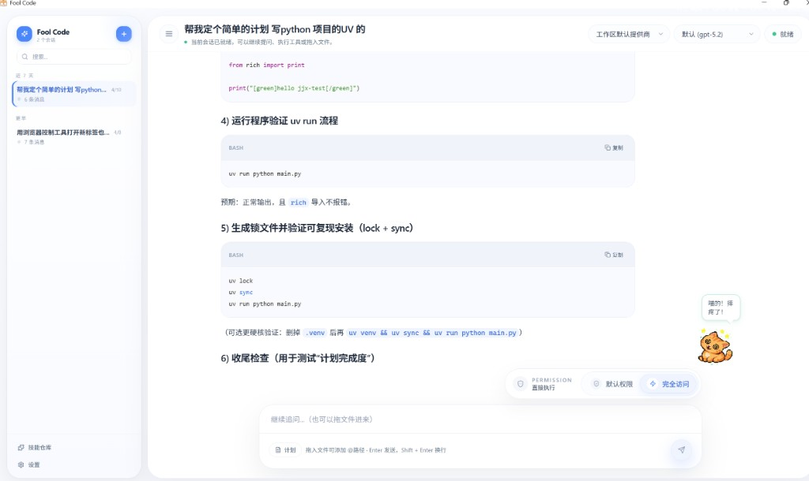

# Fool Code (Python)

一个面向桌面场景的 AI 编程助手，采用 **Python + FastAPI + React + pywebview** 架构实现。  
支持 OpenAI 兼容模型、工具调用、权限控制、多会话管理、MCP 扩展，并可打包为 Windows 可执行程序。

---

## 灵感来源

- **Claude Code**：借鉴了“对话 + 工具调用 + 权限确认”的交互范式，以及工程化代理工作流体验
- **Hermes（部分设计）**：参考了技能沉淀/复用思路，用于构建本地 Skill Store 与技能创建链路
- **本项目扩展**：在桌面形态下强化了本地记忆系统、MCP 多协议接入、可选 Computer Use 能力，并重做了更有交互感的宠物系统

---

## 项目特性

- 桌面应用体验：`pywebview` 承载前端，默认本地启动 FastAPI 服务
- 实时流式对话：基于 SSE 推送文本增量、工具调用结果、状态事件
- 工具系统：内置文件读写、搜索、Shell、Notebook、Web 等工具
- 权限体系：5 级权限模式，支持细粒度的工具执行确认
- 多会话管理：会话创建、切换、删除、压缩（长对话整理）
- MCP 集成：支持 `stdio`、`sse`、`http`、`ws` 多传输协议
- 可选原生能力：Rust + PyO3 扩展提供 Windows Computer Use 工具
- 技能创建与检索：支持批量扫描导入技能、语义检索、关系图谱、反馈闭环
- 记忆系统（特色）：支持结构化记忆 + MAGMA 情节记忆，长期上下文可回溯和查询
- 聊天宠物系统：宠物可在聊天区域内上下活动，并与聊天输入/输出过程形成轻量交互反馈

---

## 特色能力说明

### 1) 技能创建（Skill Store）

- 支持从工作区扫描技能文档并导入到本地 Skill Store
- 支持技能启用/停用、置顶、元信息编辑、关系查看、重建索引
- 支持语义检索（embedding）+ 关键词融合召回，提升命中率
- 支持记录使用反馈，便于后续优化技能质量与排序策略

### 2) 记忆系统（Memory + MAGMA）

除了常规的用户偏好记忆（静态可编辑），项目实现了一套完整的 **MAGMA（Multi-Graph Agentic Memory Architecture）情节记忆系统**，让 AI 助手能够"记住你做过什么"，而不仅仅是"你是谁"。

#### 架构概览

```text
对话结束
  │
  ▼
Fast Path（后台线程，每轮自动触发）
  ├─ LLM 事件提取：从对话中抽取决策、任务、问题等有长期价值的事件
  ├─ Embedding 生成：调用 embedding API（支持 3 级降级：专用配置 → 聊天模型 → 哈希兜底）
  └─ 写入 Rust 向量库：事件节点 + 实体 + 关联关系 → SQLite（magma.db）
  │
  ▼
Slow Path（后台定时任务，每 30s 一轮）
  ├─ 取出未巩固事件
  ├─ 2-hop 邻居扩展：获取已有事件的局部子图
  ├─ LLM 关系推理：推断因果边（A 导致 B）和实体边（A、B 涉及同一技术栈）
  └─ 写回图谱：加密图结构越来越丰富
  │
  ▼
查询时（用户提问自动触发）
  ├─ Stage 1：意图分析 + 中文时间解析（jionlp），分为 temporal_focus / general 两种模式
  ├─ Stage 1b：生成 query embedding
  ├─ 相关性门控：FTS5 关键词 / 实体名匹配 / 向量余弦相似度，任一通过才继续
  ├─ Stage 2：RRF 多信号锚点融合（向量 + 关键词 + 时间窗 + 实体）
  ├─ Stage 3：图遍历（beam search，按意图加权 temporal/causal/semantic/entity 四维）
  └─ Stage 4：线性化输出（按时间或相关性排序，带 [ref:xxxx] 溯源标签，控制 token 预算）
```

#### 实际场景举例

**场景 1：跨会话技术决策追溯**

> 三天前你和 AI 讨论过"数据库选型"，最终决定用 SQLite 而不是 PostgreSQL。  
> 今天你问："我之前为什么没用 Postgres？"  
> → MAGMA 通过关键词 `Postgres` 命中 FTS，再通过实体边 `technology:sqlite` 关联到决策事件，返回当时的完整上下文和决策理由。

**场景 2：时间范围记忆检索**

> 你问："昨天下午我都做了什么？"  
> → jionlp 解析出时间窗口 `[昨天 12:00, 昨天 23:59]`，意图切换为 `temporal_focus`，图遍历的时间权重拉到 5x，按时间线返回昨天下午的所有事件摘要。

**场景 3：因果链路推理**

> 上周你修了一个 CSS 布局 bug，后来又因为同一个组件引入了性能问题。  
> → Slow Path 巩固时 LLM 推理出因果边："修复布局 → 引发重渲染"。  
> 当你后续提到这个组件时，MAGMA 不仅返回当前事件，还会沿因果边把上下游事件一起带出来。

**场景 4：无 embedding API 时的降级运行**

> 如果你没有配置任何 embedding 服务，系统自动切换到 hash-mode：  
> → 向量信号被屏蔽（RRF 中 vector_weight=0，遍历中 lambda2=0）  
> → 完全依赖 FTS5 关键词 + 实体名匹配进行检索  
> → 记忆仍然可用，只是没有语义模糊匹配能力

#### 核心设计要点

- **Rust 原生存储**：事件、边、实体、向量全部存储在单个 SQLite 文件（`magma.db`），通过 PyO3 暴露给 Python，查询性能远高于纯 Python 实现
- **FTS5 全文索引**：事件内容自动建立全文索引，支持中文分词匹配
- **3 级 embedding 降级**：专用 embedding API → 聊天模型的 /embeddings 端点 → 确定性哈希伪向量（保证系统永远可用）
- **向量维度自适应**：首次写入时记录 canonical dimension，后续自动截断或补零对齐
- **相关性门控**：查询时先做轻量级检查（FTS/实体/余弦），无信号则跳过检索，避免无意义的计算开销
- **token 预算控制**：输出限制在 ~2000 字符，带溯源 ref 标签，不会撑爆上下文窗口

### 3) 聊天宠物系统（UI Buddy）

- 相比传统静态挂件式宠物，这套实现更强调与聊天界面的联动感
- 宠物在聊天框区域内可进行上下活动，降低长时间对话过程的单调感
- 通过轻量动画和状态反馈提升“陪伴感”，但不干扰主工作流
- 作为 UI 层能力独立实现，便于后续扩展更多动作和交互事件



---

## 技术栈

- **后端**: FastAPI, Uvicorn, Pydantic, sse-starlette
- **前端**: React 18, Vite, TailwindCSS（目录：`desktop-ui`）
- **桌面壳**: pywebview
- **请求/模型**: httpx + OpenAI 兼容 API
- **原生扩展（可选）**: Rust, PyO3, maturin
- **包管理**: uv
- **构建打包**: PyInstaller

---

## 项目结构

```text
fool-code-python/
├─ fool_code/                # Python 主代码
│  ├─ app.py                 # FastAPI 应用与 API 路由
│  ├─ main.py                # 桌面入口（启动服务 + webview）
│  ├─ runtime/               # 对话运行时、权限、配置、会话持久化
│  ├─ tools/                 # 内置工具实现与注册
│  ├─ mcp/                   # MCP 客户端与多传输协议支持
│  ├─ computer_use/          # Computer Use 能力（可选，含 Rust 扩展）
│  └─ ...                    # 其他核心模块
├─ desktop-ui/               # 前端工程（React + Vite）
├─ tests/                    # 测试用例
├─ run.py                    # 启动桌面模式
├─ start.py                  # 启动开发模式（浏览器）
└─ pyproject.toml            # Python 项目配置
```

---

## 环境要求

- Python `>=3.11,<3.14`
- Node.js `>=18`（前端开发/构建）
- 推荐操作系统：Windows 10/11（Computer Use 主要面向 Windows）
- 可选：Rust toolchain（需要编译原生扩展时）

---

## 快速开始

### 1) 克隆与安装依赖

```bash
git clone https://github.com/13906568663/fool_code.git
cd fool_code_python
uv sync
```

### 2) 安装前端依赖（首次）

```bash
cd desktop-ui
npm install
cd ..
```

### 3) 启动项目

```bash
# 桌面模式（优先）
uv run python run.py

# 浏览器模式（开发常用）
uv run python start.py

# 仅后端服务
uv run python run.py --server-only
```

---

## 配置说明

应用启动后可在 UI 设置里配置模型，也可直接维护本地配置文件：

- 用户级：`~/.fool-code/settings.json`
- 项目级：`.fool-code/settings.json`

最小配置示例：

```json
{
  "api": {
    "provider": "openai",
    "apiKey": "sk-xxx",
    "baseUrl": "https://api.openai.com/v1",
    "model": "gpt-4o"
  }
}
```

### 进阶配置（向量库与记忆）

项目包含两套本地向量检索能力（由 Rust 原生模块提供）：

- **MAGMA 向量记忆库**：`~/.fool-code/data/magma.db`
- **Skill Store 向量库**：`~/.fool-code/data/skills.db`

可通过配置控制开关与 embedding 模型：

```json
{
  "autoMemoryEnabled": true,
  "magmaMemoryEnabled": true,
  "skillStoreEnabled": true,
  "embeddingConfig": {
    "baseUrl": "https://api.openai.com/v1",
    "apiKey": "sk-xxx",
    "model": "text-embedding-3-small"
  }
}
```

说明：

- `autoMemoryEnabled`：控制通用自动记忆开关
- `magmaMemoryEnabled`：控制 MAGMA 情节记忆是否启用
- `skillStoreEnabled`：控制 Skill Store 是否启用
- `embeddingConfig`：用于语义检索/向量写入的独立 embedding 配置

---

## 开发指南

### 运行测试

```bash
uv run pytest
```

### 代码质量（如安装了 ruff）

```bash
uv run ruff check .
```

### 前端开发

```bash
cd desktop-ui
npm run dev
```

### 构建前端资源

```bash
cd desktop-ui
npm run build
cd ..
```

---

## 打包发布（Windows）

```bash
uv run pyinstaller fool_code.spec --noconfirm
```

输出目录示例：

- `dist/FoolCode/`

说明：

- 打包前请先完成前端构建（`desktop-ui/dist`）
- 若需要 Computer Use 原生能力，请先编译对应 Rust 扩展

---

## Computer Use（可选能力）

`fool_code/computer_use/_native` 提供 Rust 扩展源码。  
如果你需要截图、点击、键入、拖拽等桌面自动化能力，可按模块文档进行构建和集成。

相关说明见：

- `fool_code/computer_use/README.md`

---

## Roadmap（计划）

- [ ] 完善跨平台适配（Linux/macOS）
- [ ] 增强模型供应商配置体验
- [ ] 增加更多开箱即用 MCP 模板
- [ ] 补齐更系统化的 E2E 测试
- [ ] 持续优化桌面交互与性能

---

## 贡献指南

欢迎 Issue / PR。

建议流程：

1. Fork 仓库并创建功能分支
2. 提交变更并补充必要测试
3. 保持提交清晰（推荐小步提交）
4. 发起 PR，描述改动动机与验证方式

如果改动较大，建议先开 Issue 讨论方向。

---

## 安全与隐私

- API Key 仅保存在本地配置文件，请勿提交到仓库
- 请确保 `.env`、本地日志、编译产物等敏感/临时文件被忽略
- 开启危险权限模式前，请确认当前工作区可信

---

## 许可证

本项目倾向于**尽可能宽松的开源方式**，允许他人自由使用、修改、再分发。  
建议采用 `The Unlicense`（或 `CC0-1.0`）作为许可证，以表达“基本不设限制”的授权意图。

> 提示：即便是超宽松授权，也建议补充免责声明条款（软件按“现状”提供，不承担担保责任）。

---

## 致谢

感谢所有提出建议、提交问题与贡献代码的开发者。  
如果这个项目对你有帮助，欢迎点个 Star 支持。

